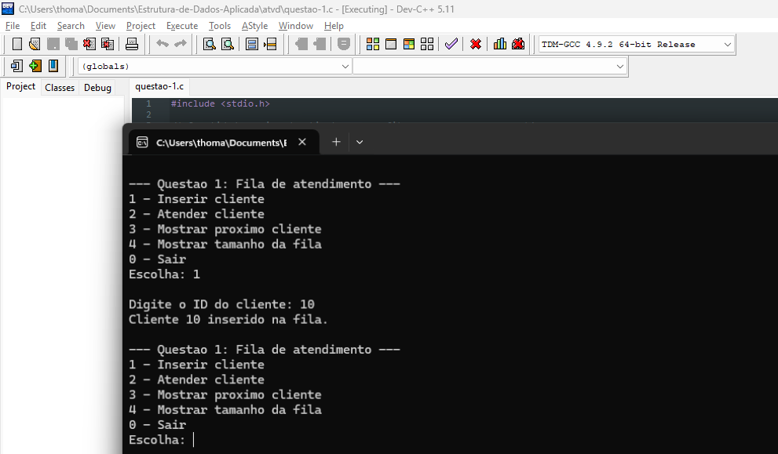
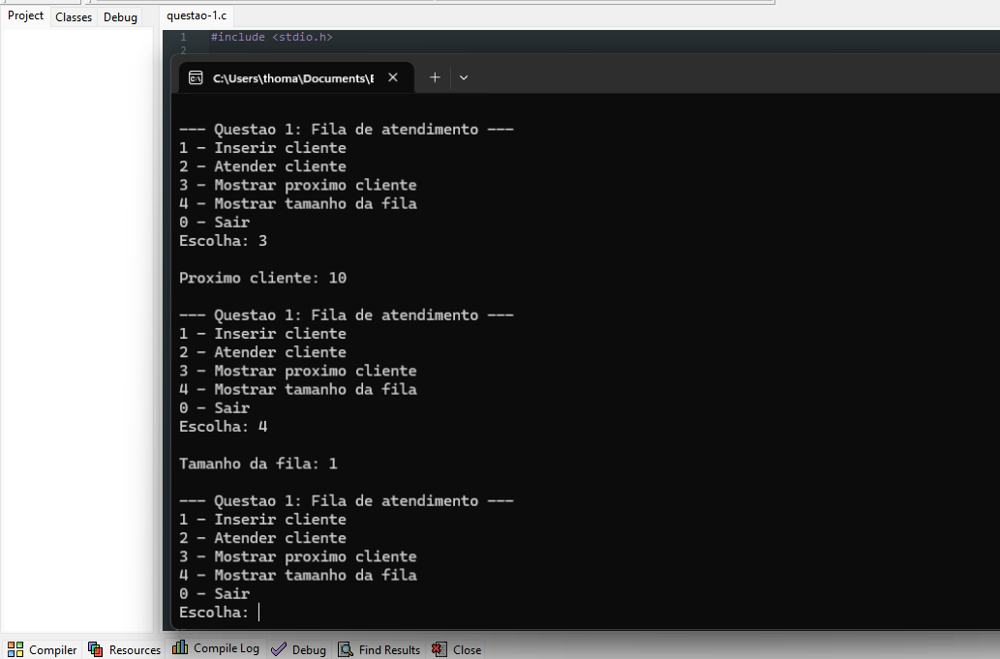
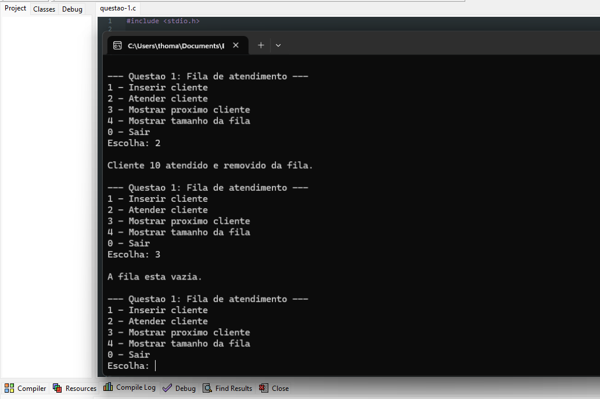
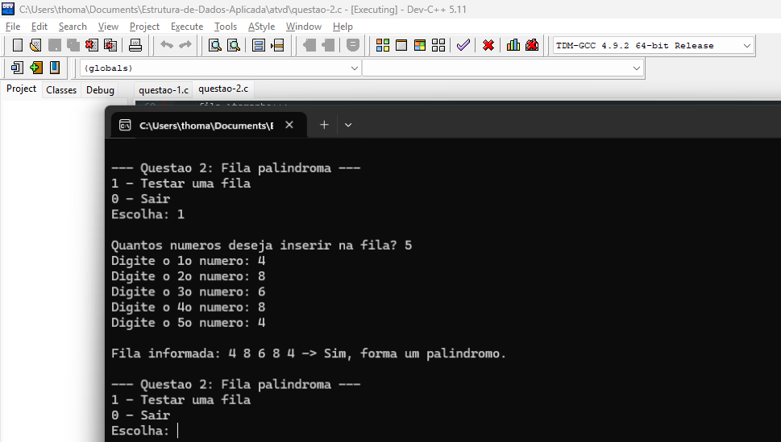
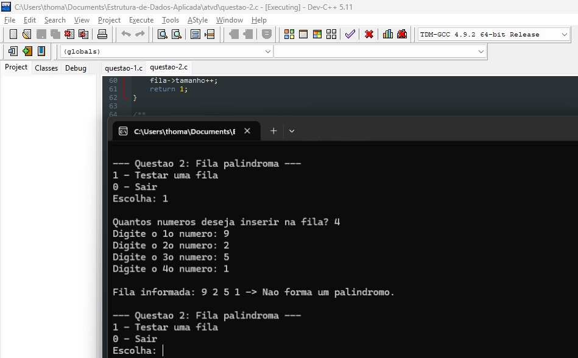
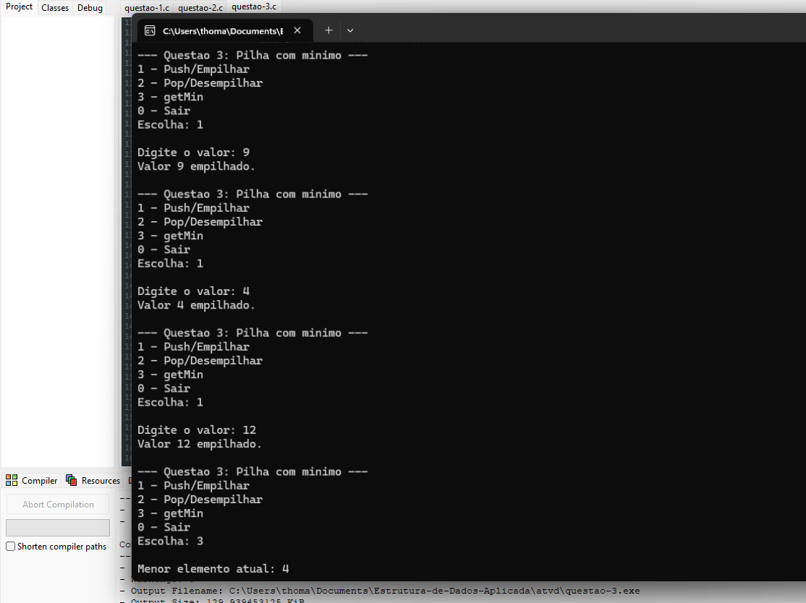
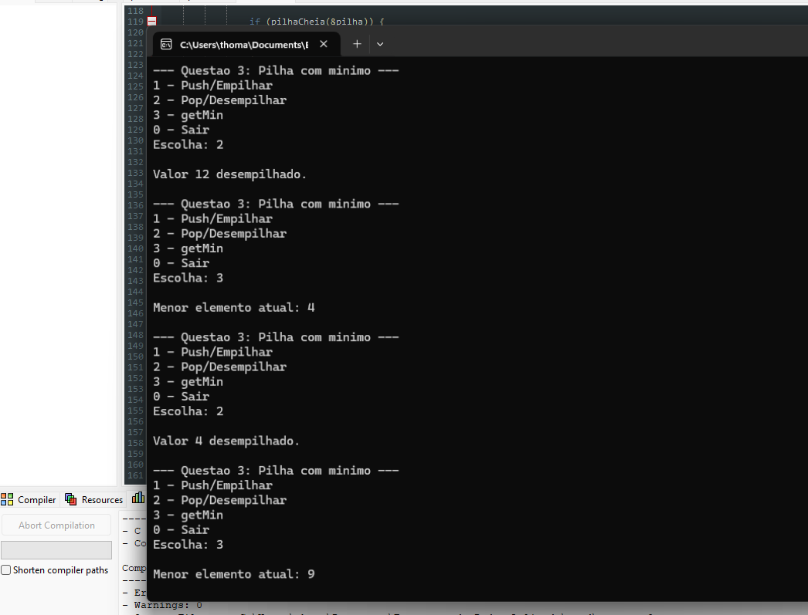

# Relatório de Testes

## Dados da atividade

- **Atividade:** Filas e Pilhas
- **Arquivos testados:** `questao-1.c`, `questao-2.c`, `questao-3.c`, `questao-4.c` e `questao-5.c`
- **Aluno:** Felipe Eduardo Kadanos
- **Rgm:** 41277473
- **Data:** 15/05/2026

## Objetivo

Este relatório apresenta os testes realizados para comprovar a execução das funcionalidades implementadas nas cinco questões da atividade. Os valores utilizados nos testes são diferentes dos exemplos do enunciado.

## Questão 1 - Simulação de fila de atendimento

**Arquivo testado:** `questao-1.c`

### Teste 1.1 - Inserir clientes na fila

**Objetivo do teste:** validar se o sistema permite inserir clientes na fila usando seus IDs.

**Entrada utilizadas:**

```text
Cliente: 10
```

**Resultado esperado:** os clientes devem ser adicionados na ordem informada.

**Print da execução:**



### Teste 1.2 - Mostrar próximo cliente e tamanho da fila

**Objetivo do teste:** validar se o primeiro cliente inserido aparece como próximo atendimento e se o tamanho da fila está correto.

**Entradas utilizadas:**

```text
3 - Mostrar próximo cliente
4 - Mostrar tamanho da fila
```

**Resultado esperado:** o próximo cliente deve ser `10` e o tamanho da fila deve ser `1`.

**Print da execução:**



### Teste 1.3 - Atender cliente

**Objetivo do teste:** validar se o cliente atendido é removido da fila.

**Entradas utilizadas:**

```text
2 - Atender cliente
3 - Mostrar próximo cliente
```

**Resultado esperado:** o cliente `10` deve ser atendido e a fila deve estar vazia.

**Print da execução:**




## Questão 2 - Verificação de fila palíndroma

**Arquivo testado:** `questao-2.c`

### Teste 2.1 - Fila palíndroma

**Objetivo do teste:** validar se o programa identifica corretamente uma fila que forma um palíndromo.

**Entradas utilizadas:**

```text
Quantidade: 5
Fila: 4 8 6 8 4
```

**Resultado esperado:** o programa deve informar que a fila forma um palíndromo.

**Print da execução:**



### Teste 2.2 - Fila não palíndroma

**Objetivo do teste:** validar se o programa identifica corretamente uma fila que não forma um palíndromo.

**Entradas utilizadas:**

```text
Quantidade: 4
Fila: 9 2 5 1
```

**Resultado esperado:** o programa deve informar que a fila não forma um palíndromo.

**Print da execução:**




## Questão 3 - Pilha com mínimo

**Arquivo testado:** `questao-3.c`

### Teste 3.1 - Empilhar valores e consultar menor elemento

**Objetivo do teste:** validar se a pilha retorna o menor elemento em tempo real após operações de empilhar.

**Entradas utilizadas:**

```text
1 - Push/Empilhar: 9
1 - Push/Empilhar: 4
1 - Push/Empilhar: 12
3 - getMin
```

**Resultado esperado:** o menor elemento atual deve ser `4`.

**Print da execução:**



### Teste 3.2 - Desempilhar e consultar menor elemento

**Objetivo do teste:** validar se o menor elemento continua correto após operações de desempilhar.

**Entradas utilizadas:**

```text
2 - Pop/Desempilhar
3 - getMin
2 - Pop/Desempilhar
3 - getMin
```

**Resultado esperado:** após remover `12`, o menor deve continuar `4`; após remover `4`, o menor deve ser `9`.

**Print da execução:**

